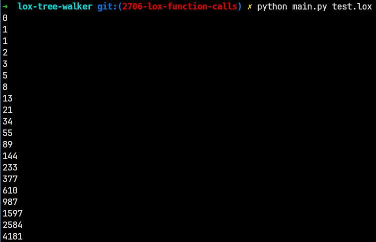

# monkey-tree-walker

An implementation of a tree walking interpreter for the Lox language designed by Robert Nystrom in his book 'Crafting Interpreters'.

```
fun fib(n) {
  if (n <= 1) return n;
  return fib(n - 2) + fib(n - 1);
}

for (var i = 0; i < 20; i = i + 1) {
  print fib(i);
}
```


